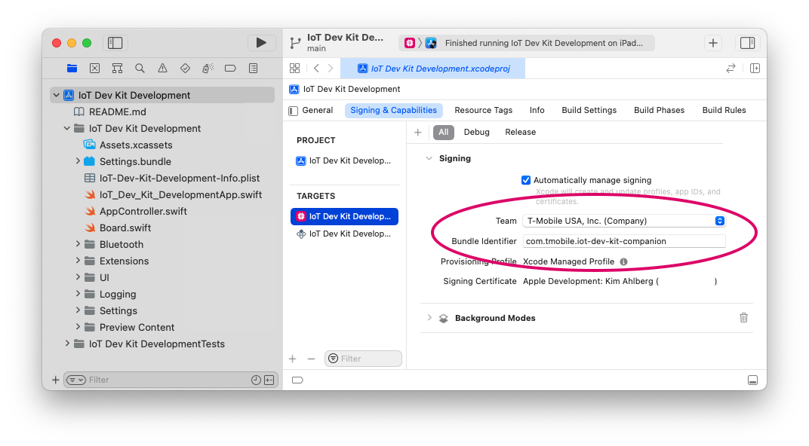
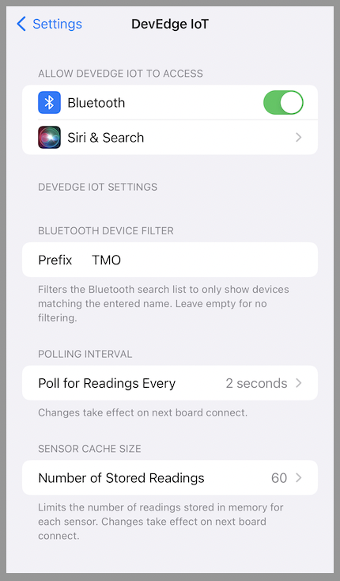

# TERMS OF USE
Access and use of this repository and any files, code, or information contained herein is subject to the terms and execution of the “Participation Agreement”

# Transferring Data Between iOS and a T-Mobile DevEdge IoT DevKit Board

This code project builds an iOS app that allows users to connect to the T-Mobile DevEdge IoT DevKit board over Bluetooth Low Energy (BLE) and read values from it.


## Overview

The project can be used as sample code for programmers who wish to learn how to transfer data between the T-Mobile DevEdge IoT DevKit board and an iOS app.
While the user interface is built in SwiftUI, the Bluetooth communication code is useful also for UIKit-based apps.

These are the code files most relevant to the Bluetooth communication:
- **Board.swift** - This models the T-Mobile DevEdge board's state by storing all the values that have been read from the connected board. The app UI reflects this model's state.
- **Bluetooth/BluetoothManager.swift** - This handles discovering and connecting to the T-Mobile DevEdge IoT DevKit board, as well as reading and writing values to the board.
- **Bluetooth/DataParser.swift** - This contains functions that parse values from the data provided by the connected board. (1)
- **Extensions/CBUUID.swift** - This provides identifiers for the Bluetooth services and characteristics used by the project. (2)

## Configure the Sample Code Project
Before building and running the app you should change the _Team_ and _Bundle Identifier_ in the app target's __Signing & Capabilities__ tab.



## App Settings in the iOS Settings app
The project uses a settings bundle to expose a number of configurable settings in the iOS Settings app for configuring Bluetooth device filtering (via the device name prefix), value polling interval and data cache size.
The property wrapper `SettingsValue` is used by the code to access configured values from the settings bundle.



***

# Code How To

This is a starter guide to the basic steps necessary to connect to and read information from a BLE peripheral using [Core Bluetooth](https://developer.apple.com/documentation/corebluetooth).
Understanding the below steps will make it easier to understand how the code project's Bluetooth communication implemented in **BluetoothManager.swift** works.

**NOTE:** Your app's **Info.plist** needs to include a usage description for the [`NSBluetoothAlwaysUsageDescription`](https://developer.apple.com/documentation/bundleresources/information_property_list/nsbluetoothalwaysusagedescription) key in order to access Core Bluetooth APIs without crashing.

## How To Discover the T-Mobile DevEdge IoT DevKit Board and Connect to It

The Core Bluetooth framework must be imported in order to call its API methods.

``` swift
import CoreBluetooth
```

To use Core Bluetooth to discover nearby BLE devices you need to create a [`CBCentralManager`](https://developer.apple.com/documentation/corebluetooth/cbcentralmanager) and assign an object implementing the [`CBCentralManagerDelegate`](https://developer.apple.com/documentation/corebluetooth/cbcentralmanagerdelegate) protocol as the manager’s delegate.
Then call [`scanForPeripherals`](https://developer.apple.com/documentation/corebluetooth/cbcentralmanager/1518986-scanforperipherals), optionally passing in the specific service UUIDs you want to look for.

``` swift
self.centralManager = CBCentralManager(delegate: self, queue: nil)
self.centralManager.scanForPeripherals(withServices: nil, options: nil)
```

When the central manager discovers a peripheral it calls the delegate's [`centralManager(_:didDiscover:advertisementData:rssi:)`](https://developer.apple.com/documentation/corebluetooth/cbcentralmanagerdelegate/1518937-centralmanager) method.
To establish a connection to a discovered peripheral you call [`connect`](https://developer.apple.com/documentation/corebluetooth/cbcentralmanager/1518766-connect) on it. Once the peripheral you want to connect to has been discovered you can call [`stopScan`](https://developer.apple.com/documentation/corebluetooth/cbcentralmanager/1518984-stopscan) on the central manager.

``` swift
func centralManager(_ central: CBCentralManager, didDiscover peripheral: CBPeripheral,
                    advertisementData: [String: Any], rssi RSSI: NSNumber) {
    
    let peripheralName: String = peripheral.name ?? "n/a"
    
    // Connect if this is the peripheral we want to access. 
    if peripheralName == "T-Mobile DevEdge" { 
        centralManager.connect(peripheral, options: nil)
        centralManager.stopScan()
    }
}
```

After the connection has been established, the central manager calls the delegate's [`centralManager(_:didConnect:)`](https://developer.apple.com/documentation/corebluetooth/cbcentralmanagerdelegate/1518969-centralmanager) method.

## How To Discover Services and Characteristics For the Established Connection

Before reading data from the connected peripheral you need to access the service and characteristic for the specific data you want to read. First, an object that implements the [`CBPeripheralDelegate`](https://developer.apple.com/documentation/corebluetooth/cbperipheraldelegate) protocol should be assigned as the peripheral's delegate. Then, call the peripheral's [`discoverServices`](https://developer.apple.com/documentation/corebluetooth/cbperipheral/1518706-discoverservices) method with an optional array of service UUIDs to search for. You also want to hold on to the connected peripheral in order to disconnect from it later on.

``` swift
public func centralManager(_ central: CBCentralManager, didConnect peripheral: CBPeripheral) {
    
    peripheral.delegate = self
    peripheral.discoverServices(nil)
    self.connectedPeripheral = peripheral
}
```

As services are found, the peripheral delegate's [`peripheral(_:didDiscoverServices:)`](https://developer.apple.com/documentation/corebluetooth/cbperipheraldelegate/1518744-peripheral) method will be called.
You then use the peripheral's [`discoverCharacteristics`](https://developer.apple.com/documentation/corebluetooth/cbperipheral/1518797-discovercharacteristics) method to discover the available characteristics for each service, providing an optional array of characteristic UUIDs to look for.

``` swift
public func peripheral(_ peripheral: CBPeripheral, didDiscoverServices error: Error?) {
    
    guard let peripheralServices = peripheral.services else { return }
    
    for service in peripheralServices {
        peripheral.discoverCharacteristics(nil, for: service)
    }
}
```

As characteristics are found, the peripheral delegate's [`peripheral(_:didDiscoverCharacteristicsFor:error:)`](https://developer.apple.com/documentation/corebluetooth/cbperipheraldelegate/1518821-peripheral) method will be called.
The characteristics allow us to read, and in some cases, write values to the T-Mobile DevEdge board.

## How To Read Data From a Characteristic

Now that you have found characteristics you can attempt to read values from them using the peripherals [`readValue`](https://developer.apple.com/documentation/corebluetooth/cbperipheral/1518759-readvalue) method. You might also want to hold on to the characteristics in order to be able to periodically read their updated values.

``` swift 
public func peripheral(_ peripheral: CBPeripheral, didDiscoverCharacteristicsFor service: CBService, error: Error?) {

    guard let characteristics = service.characteristics else { return }
    
    for characteristic in characteristics {
        peripheral.readValue(for: characteristic)
    }
}
```

When the characteristic's value arrives from the peripheral, the peripheral delegate's [`peripheral(_:didUpdateValueFor:error:)`](https://developer.apple.com/documentation/corebluetooth/cbperipheraldelegate/1518708-peripheral) method will be called to let you can parse the data.

``` swift
public func peripheral(_ peripheral: CBPeripheral, didUpdateValueFor characteristic: CBCharacteristic, error: Error?) {

    if let error = error {
        let attError = CBATTError(_nsError: error as NSError)
        print("Error updating value for characteristic '\( characteristic.uuid )':")
        print("-- Error code: \( attError.errorCode ) - \( attError.localizedDescription )")
        return
    }
    
    // Parse data from the Temperature characteristic (org.bluetooth.characteristic.temperature). 
    // 0x2A6E is the identifier for the Temperature characteristic.
    if characteristic.uuid == CBUUID(string: "0x2A6E") { 

        if let data = characteristic.value {
            
            // NOTE: Temperature is transmitted as a 2-byte value, we parse it into a signed 16-bit integer, Int16.
        
            if data.count < 2 { return }
            let intValue = data.withUnsafeBytes { $0.load(as: Int16.self) }

            // Convert to Celsius. The sensor provides values as 100 * {Temperature in °C}.
            let temperature = Double(intValue)/100.0
        
            print("Temperature is: \( String(temperature) )°C")
        }
    } else {
        print("A value from an unhandled characteristic '\( characteristic.uuid )' was received.")
    }
}
```

## How To Disconnect

Disconnect from a peripheral by calling the central manager's [`cancelPeripheralConnection`](https://developer.apple.com/documentation/corebluetooth/cbcentralmanager/1518952-cancelperipheralconnection) method and provide the connected peripheral as the argument.

``` swift
if let disconnectionPeripheral = self.connectedPeripheral {
	self.centralManager?.cancelPeripheralConnection(disconnectionPeripheral)
}
```

When the peripheral disconnects, the central manager calls its delegate's [`centralManager(_:didDisconnectPeripheral:error:)`](https://developer.apple.com/documentation/corebluetooth/cbcentralmanagerdelegate/1518791-centralmanager) method which lets you remove the peripheral's delegate and your reference to the peripheral.

``` swift
public func centralManager(_ central: CBCentralManager, didDisconnectPeripheral peripheral: CBPeripheral, error: Error?) {

    peripheral.delegate = nil
    if self.connectedPeripheral == peripheral {
        self.connectedPeripheral = nil
    }
}
```

## References

Reference the [`Bluetooth Specifications`](https://www.bluetooth.com/specifications/) documentation, and in particular:
1. [`GATT Specification Supplement 5`](https://www.bluetooth.com/specifications/specs/gatt-specification-supplement-5/), which explains the data formats used by each characteristic.
2. [`16-bit UUID Numbers`](https://btprodspecificationrefs.blob.core.windows.net/assigned-values/16-bit%20UUID%20Numbers%20Document.pdf), which contains a list of the 16-bit Universally Unique Identifier (UUID) values defined for Bluetooth services and characteristics.


***

# Firmware development debugging tips

When connecting to a peripheral over Bluetooth, the app's Debug screen provides information about all the services and characteristics discovered for the peripheral.

An attempt to read a value is performed for each discovered characteristic. If the characteristic is not one the app is set up to handle, a log event that lists the received value bytes is shown in the Debug screen.

It is recommended to connect to your board, wait long enough for the initial read attempts to complete, and then disconnect to take a look at the received values in the Debug screen.

Since unhandled characteristics are not included in the app's continuous polling it may help to increase the polling interval, in order to avoid flooding the the Debug screen with log events. The polling interval can be configured in the iOS Settings app.

